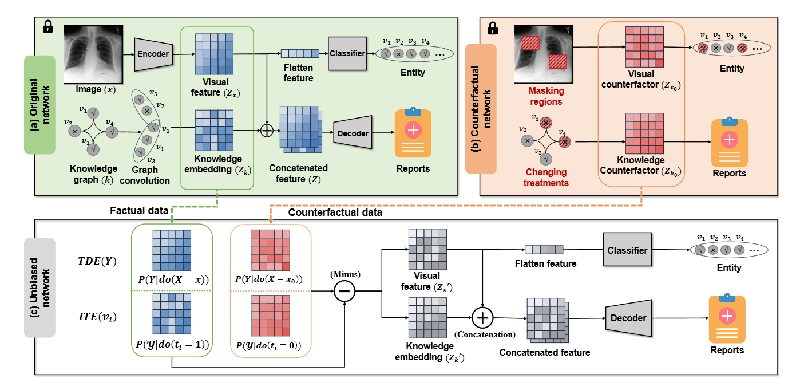

# Unbiased Diagnostic Report Generation via Multi-modal Counterfactual Inference

## Abstract

Automated diagnostic report generation is a challenging vision-and-language bridging task focusing on accurate descriptions of medical images and cross-modal causal inference. 
The task holds considerable clinical significance, yet its extensive application remains challenging. Existing methods often rely on pre-trained models with large-scale medical report datasets, which leads to data shift between training and testing sets, resulting in phenomena such as irrelevant contextual biases in the visual domain and correlation biases within the knowledge graph. To this end, we propose Multimodal Counterfactual Unbiased Report Generation (MCURG) by incorporating causal inference to exploit invariant rationales. Our key idea is to leverage counterfactual inference to reduce visual bias and knowledge bias. Our MCURG employs a Structural Causal Model to elucidate the complex relationships among images, knowledge graphs, reports, confounders, and personalized features. We design two multimodal debiasing modules: a visual debiasing module and a knowledge graph debiasing module. The visual debiasing module focuses on the Total Direct Effect of image features, mitigating confounding. The knowledge graph debiasing module discovers individualized treatments within the graph, reducing spurious generations. We have conducted extensive experiments and comprehensive evaluations on multiple datasets, and demonstrate our MCURG can effectively reduce the bias and improve the accuracy of the generated reports.

## Method

 *Figure 1. *The overview of the proposed unbiased report generation. The unbiased network utilizes the intermediate features from two pre-trained networks as input. All networks adopt the framework shown in (a), differing in the fact that the original network takes images from the original dataset and knowledge graph, while the counterfactual network takes images with masked local regions and knowledge graphs with modified treatments. After fixing the parameters of the two networks mentioned above, the unbiased network eliminates the counterfactual confounding factors from the original biased features for unbiased training. We obtain the total direct effect (TDE) by comparing the differences in image features, and we obtain the individual treatment effect (ITE) of knowledge nodes by removing the confounding factors in the knowledge graph.*

## Setup

1. Create conda environment with "**pip install -r requirement.txt**"
2. In [path_datasets_and_weights.py](src/path_datasets_and_weights.py), specify the datasets, phase, model name and checkpoints paths. Follow the instructions of the doc string of path_datasets_and_weights.py.

After the setup, create train, val and test csv files, in which each row contains specific information about a single image. See doc string of create_dataset.py for more details.

As a side note - we cannot provide you these files directly (i.e. you have to create these csv files yourself), since they contain patient information from Chest ImaGenome/MIMIC-CXR, to which only credentialed users with training in handling human participant data should have access (for privacy reasons).

## Training 

1. Original network: set IMAGE_MODE in [path_datasets_and_weights.py](path_datasets_and_weights.py) as origin;  run "**python [train_full.py](train_full.py)**"  to train original network.
2. Counterfactual network: set IMAGE_MODE in [path_datasets_and_weights.py](path_datasets_and_weights.py) as mask;  run "**python [train_full.py](train_full.py)**"  to train counterfactual network.
3. Unbiased network: set IMAGE_MODE in [path_datasets_and_weights.py](path_datasets_and_weights.py) as unbias;  run "**python [train_full.py](train_full.py)**"  to train unbiased network.

Thank you to the development of the [xray report_generation](https://github.com/ginobilinie/xray_report_generation) project for providing us with the baseline.
